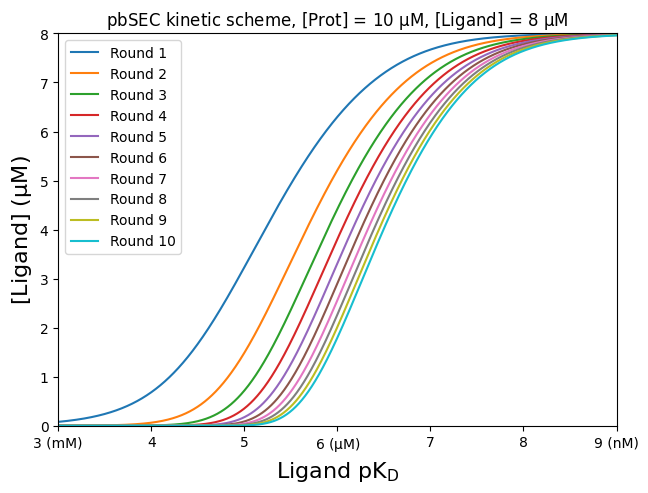
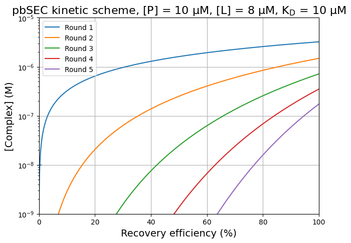
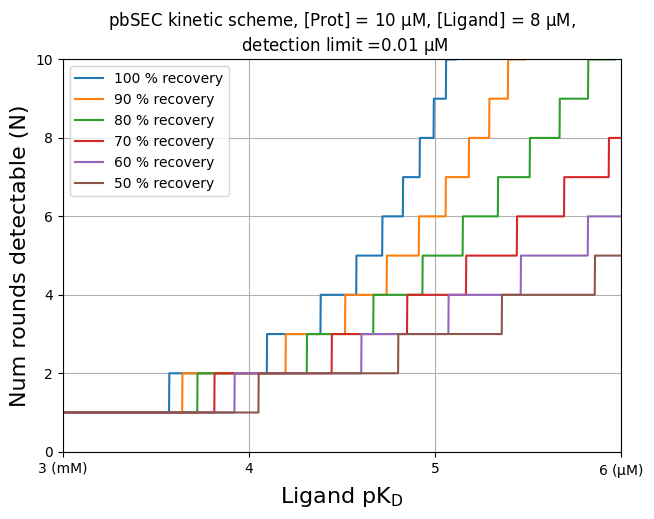
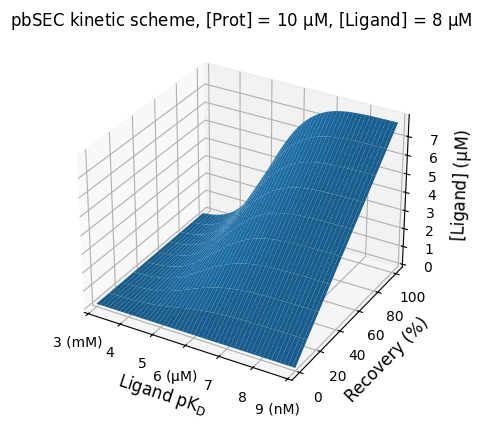

# pbSEC_simulation
Code repository for simulation of plate-based size exclusion chromatography (pbSEC) runs. 

This repository accompanies a soon to be published protocol.


## Example usage:
Please see the included notebook pbSEC_notebook.ipynb to explore the following functionality:


### Simulation of a single pbSEC run
```python
from pbsec import pbSEC

pbsec_parameters = dict(
    p=10,  # Protein concentration
    l=8,  # Ligand concentration
    kdpl=10,  # Protein-ligand complex KD
    recovery_efficiency=1.0,  # Fraction efficiency - 90 % recovery efficiency is denoted by a value of 0.9
)
print(f"Using the following parameters: {pbsec_parameters}")
simulation_result = pbSEC(
    **pbsec_parameters
)
# Simulate a single pbSEC run with 100 % efficiency
print(f"Amount complex (also amount ligand) = {simulation_result}")
```
Output:
```bash
Using the following parameters: {'p': 10, 'l': 8, 'kdpl': 10, 'recovery_efficiency': 1.0}
Amount complex (also amount ligand) = 3.229670385730992
```

### Simulation of pbSEC iterations


```python
from pbsec import pbSEC_simulate_n_rounds

pbsec_parameters = dict(
    p=10,  # Protein concentration
    l=8,  # Ligand concentration
    kdpl=10,  # Protein-ligand complex KD
    recovery_efficiency=1.0,  # Fraction efficiency - 90 % recovery efficiency is denoted by a value of 0.9
    num_iterations=10,  # Number of pbSEC iterations
)

print(f"Using the following parameters: {pbsec_parameters}")
simulation_result = pbSEC_simulate_n_rounds(**pbsec_parameters)
print(
    f"Amount complex (also amount ligand) at each iteration =   {simulation_result}",
)
```
Output:
```
Using the following parameters: {'p': 10, 'l': 8, 'kdpl': 10, 'recovery_efficiency': 1.0, 'num_iterations': 10}
Amount complex (also amount ligand) at each iteration = [3.229670385730992, 1.485289660112462, 0.7151066803602028, 0.3511631623450422, 0.17404025537442974, 0.08664150972365803, 0.04322692091197959, 0.021590103399623268, 0.010789225044449048, 0.0053931574301171415]
``````
### Simulation of iterative pbSEC runs until instrument detection limit is reached

Perform iterative pbSEC runs using protein and ligand with known KD and iterate
until the specified detection limit is reached.


```python
from pbsec import pbSEC_iterate_until_undetectable

pbsec_parameters = dict(
    p=10,  # Protein concentration
    l=8,  # Ligand concentration
    kdpl=10,  # Protein-ligand complex KD
    recovery_efficiency=1.0,  # Fraction efficiency - 90 % recovery efficiency is denoted by a value of 0.9
    l_detection_limit=0.001,  # Ligand detection limit
)
print(f"Using the following parameters: {pbsec_parameters}")
simulation_result = pbSEC_iterate_until_undetectable(**pbsec_parameters)
print(f"Amount complex (also amount ligand) at each of {len(simulation_result)} iterations = {simulation_result}")
```
Output:
```
Using the following parameters: {'p': 10, 'l': 8, 'kdpl': 10, 'recovery_efficiency': 1.0, 'l_detection_limit': 0.001}
Amount complex (also amount ligand) at each of 12 iterations = [3.229670385730992, 1.485289660112462, 0.7151066803602028, 0.3511631623450422, 0.17404025537442974, 0.08664150972365803, 0.04322692091197959, 0.021590103399623268, 0.010789225044449048, 0.0053931574301171415, 0.002696215138226855, 0.0013480166994129454]

```

### Plot pbSEC rounds, pKd vs concentration


```python
import numpy as np
from pbsec import pbSEC_simulate_n_rounds
import matplotlib.pyplot as plt

XAXIS_BEGINNING = 3  # pKD of 3 is 1 mM
XAXIS_END = 9  # pKD of 12 is 1 pM
NUM_POINTS_ON_XAXIS = 2000  # Publication used 2000 pts along X
PROTEIN_CONC = 10.0
LIGAND_CONC = 8.0  # Singular compound conc in pool
NUM_ROUNDS = 10
RECOVERY_EFFICIENCY = 1.0

x_axis = np.linspace(XAXIS_BEGINNING, XAXIS_END, NUM_POINTS_ON_XAXIS)
ligand_kd_range = 10 ** (-x_axis) * 1e6
protein_concs = np.full((NUM_ROUNDS, NUM_POINTS_ON_XAXIS), np.nan)

for kd_i, kd in enumerate(ligand_kd_range):
    protein_concs[:, kd_i] = pbSEC_simulate_n_rounds(
        PROTEIN_CONC,
        LIGAND_CONC,
        kd,
        NUM_ROUNDS,
        recovery_efficiency=RECOVERY_EFFICIENCY,
    )

fig, ax = plt.subplots(1, 1, figsize=(7.204724, 5.09424929292))

for i in range(NUM_ROUNDS):
    ax.plot(x_axis, protein_concs[i], label="Round " + str(i + 1))
# ax.hlines(1,3,9)
plt.legend()

ax.set_xticks(
    range(XAXIS_BEGINNING, XAXIS_END + 1),
    ["3 (mM)", "4", "5", r"6 ($\mathrm{\mu}$M)", "7", "8", "9 (nM)"],
)
ax.set_xlim(3, 9)
ax.set_ylim(0, 8)
ax.set_xlabel(r"Ligand pK$_\mathrm{D}$", fontsize=16)
ax.set_ylabel(r"[Ligand] ($\mathrm{\mu}$M)", fontsize=16)
ax.set_title(
    "pbSEC kinetic scheme, [Prot] = 10 $\mathrm{\mu}$M, [Ligand] = 8 $\mathrm{\mu}$M"
)
plt.show()
```
Output:

    

    
### Plot pbSEC rounds, recovery efficiency vs log complex

```python
import numpy as np
from pbsec import pbSEC_simulate_n_rounds
import matplotlib.pyplot as plt

XAXIS_BEGINNING = 0  # pKD of 3 is mM
XAXIS_END = 100  # pKD of 12 is pM
YAXIS_BEGINNING = 1e-3
YAXIS_END = 10
NUM_POINTS_ON_XAXIS = 2000  # Publication used 2000 pts along X
PROTEIN_CONC = 10.0
LIGAND_CONC = 8.0  # Singular compound conc in pool
KD = 10  # 1 µM
NUM_ROUNDS = 5

x_axis = np.linspace(XAXIS_BEGINNING, XAXIS_END, NUM_POINTS_ON_XAXIS)
# ligand_kd_range = 10**(-x_axis)*1e6
ligand_concs = np.full((NUM_ROUNDS, NUM_POINTS_ON_XAXIS), np.nan)

for efficiency_i, efficiency in enumerate(x_axis / 100.0):
    ligand_concs[:, efficiency_i] = pbSEC_simulate_n_rounds(
        PROTEIN_CONC, LIGAND_CONC, KD, NUM_ROUNDS, recovery_efficiency=efficiency
    )

ligand_concs *= 1e-6

fig, ax = plt.subplots(1, 1, figsize=(7.204724, 5.09424929292))

for i in range(NUM_ROUNDS):
    ax.plot(x_axis, ligand_concs[i], label="Round " + str(i + 1))
ax.hlines(1e-8, 0, 1)
plt.legend()
plt.yscale("log")
ax.set_xlim(0, 100)
ax.set_ylim(1e-9, 1e-5)
plt.grid(True)
# L,B,R,T
ax.set_xlabel(r"Recovery efficiency (%)", fontsize=14)
ax.set_ylabel(r"[Complex] (M)", fontsize=14)
ax.set_title(
    r"pbSEC kinetic scheme, [P] = 10 $\mathrm{\mu}$M, [L] = 8 $\mathrm{\mu}$M, K$_\mathrm{D}$ = "
    + str(KD)
    + " µM",
    fontsize=16,
)
plt.show()
```
Output:

    
### Plot pbSEC rounds, pKd vs num rounds detectable for
```python
import numpy as np
from pbsec import pbSEC_iterate_until_undetectable
import matplotlib.pyplot as plt

XAXIS_BEGINNING = 3  # pKD of 3 is 1 mM
XAXIS_END = 6  # pKD of 12 is 1 pM
NUM_POINTS_ON_XAXIS = 2000  # Publication used 2000 pts along X
PROTEIN_CONC = 10.0
LIGAND_CONC = 8.0  # Singular compound conc in pool
RECOVERY_EFFICIENCIES = np.arange(1.0, 0.4, -0.1)
L_DETECTION_LIMIT = 0.01


x_axis = np.linspace(XAXIS_BEGINNING, XAXIS_END, NUM_POINTS_ON_XAXIS)
ligand_kd_range = 10 ** (-x_axis) * 1e6
num_iterations_taken = np.empty(
    (len(RECOVERY_EFFICIENCIES), NUM_POINTS_ON_XAXIS), dtype=int
)

for recovery_efficiency_i, recovery_efficiency in enumerate(RECOVERY_EFFICIENCIES):
    for kd_i, kd in enumerate(ligand_kd_range):
        num_iterations_taken[recovery_efficiency_i, kd_i] = len(
            pbSEC_iterate_until_undetectable(
                PROTEIN_CONC,
                LIGAND_CONC,
                kd,
                L_DETECTION_LIMIT,
                recovery_efficiency=recovery_efficiency,
            )
        )

fig, ax = plt.subplots(1, 1, figsize=(7.204724, 5.09424929292))

for recovery_efficiency_i, recovery_efficiency in enumerate(RECOVERY_EFFICIENCIES):
    ax.plot(
        x_axis,
        num_iterations_taken[recovery_efficiency_i],
        label=f"{recovery_efficiency*100:2.0f} % recovery",
    )
plt.legend()

ax.set_xticks(
    range(XAXIS_BEGINNING, XAXIS_END + 1),
    ["3 (mM)", "4", "5", r"6 ($\mathrm{\mu}$M)"],
)
# ax.set_xticks(range(XAXIS_BEGINNING, XAXIS_END+1))
ax.set_xlim(XAXIS_BEGINNING, XAXIS_END)
ax.set_ylim(0, 10)
# plt.yscale('log')
plt.grid(True)
ax.set_xlabel(r"Ligand pK$_\mathrm{D}$", fontsize=16)
ax.set_ylabel(r"Num rounds detectable (N)", fontsize=16)
ax.set_title(
    "pbSEC kinetic scheme, [Prot] = 10 $\mathrm{\mu}$M, [Ligand] = 8 $\mathrm{\mu}$M,\n detection limit ="
    + str(L_DETECTION_LIMIT)
    + " $\mathrm{\mu}$M"
)
plt.show()
```
Output:    

    
### Plot pbSEC conc vs recovery vs pKD
```python
import numpy as np
from pbsec import pbSEC_simulate_n_rounds
import matplotlib.pyplot as plt

XAXIS_BEGINNING = 3  # pKD of 3 is 1 mM
XAXIS_END = 9  # pKD of 12 is 1 pM
NUM_POINTS_ON_XAXIS = 200  # Publication used 2000 pts along X
PROTEIN_CONC = 10.0 # Protein concentration
LIGAND_CONC = 8.0  # Singular compound conc in pool
NUM_ROUNDS = 1 # Simulate only 1 round
RECOVERY_EFFICIENCY_START = 0
RECOVERY_EFFICIENCY_END = 100
recovery_efficiencies = np.linspace(
    RECOVERY_EFFICIENCY_START, RECOVERY_EFFICIENCY_END, num=10
)


x_axis = np.linspace(XAXIS_BEGINNING, XAXIS_END, NUM_POINTS_ON_XAXIS)
ligand_kd_range = 10 ** (-x_axis) * 1e6
protein_concs = np.empty(
    (NUM_ROUNDS, recovery_efficiencies.shape[0], NUM_POINTS_ON_XAXIS))

for recovery_efficiency_i, recovery_efficiency in enumerate(recovery_efficiencies):
    for kd_i, kd in enumerate(ligand_kd_range):
        protein_concs[:, recovery_efficiency_i, kd_i] = pbSEC_simulate_n_rounds(
            PROTEIN_CONC,
            LIGAND_CONC,
            kd,
            NUM_ROUNDS,
            recovery_efficiency=recovery_efficiency,
        )
protein_concs *= 1e-2
import matplotlib.pyplot as plt
from mpl_toolkits.mplot3d import Axes3D
fig = plt.figure()
ax = fig.add_subplot(111, projection='3d')

X, Y = np.meshgrid(x_axis, recovery_efficiencies)
Z = np.full(X.shape, np.nan)
for round in reversed(range(NUM_ROUNDS)):
    for i in range(x_axis.shape[0]):
        for j in range(recovery_efficiencies.shape[0]):
            Z[j][i] = protein_concs[round, j, i]
    ax.plot_surface(X, Y, Z, label="Round " + str(round + 1))

ax.set_xticks(np.arange(XAXIS_BEGINNING, XAXIS_END+1), ["3 (mM)", "4", "5", r"6 ($\mathrm{\mu}$M)", "7", "8", "9 (nM)"])
ax.set_xlim(3, 9)
ax.set_xlabel(r"Ligand pK$_\mathrm{D}$", fontsize=12)
ax.set_ylabel(r"Recovery (%)", fontsize=12)
ax.set_zlabel(r"[Ligand] ($\mathrm{\mu}$M)", fontsize=12)
ax.set_title(
    "pbSEC kinetic scheme, [Prot] = 10 $\mathrm{\mu}$M, [Ligand] = 8 $\mathrm{\mu}$M"
)
plt.show()

```
Output

    

